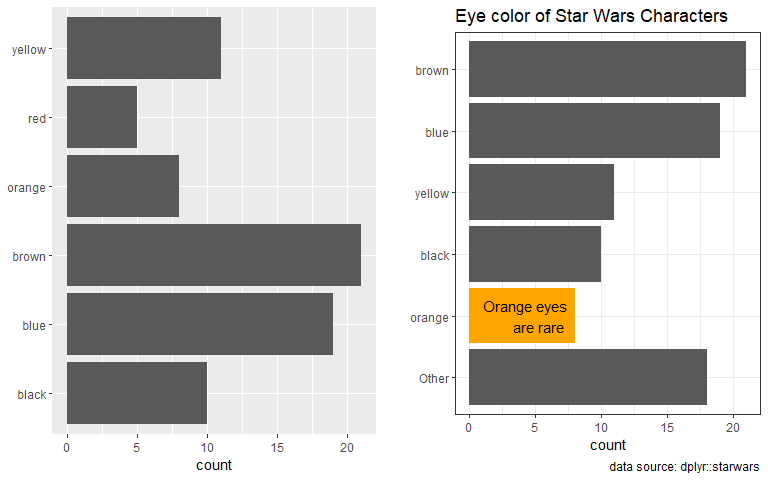
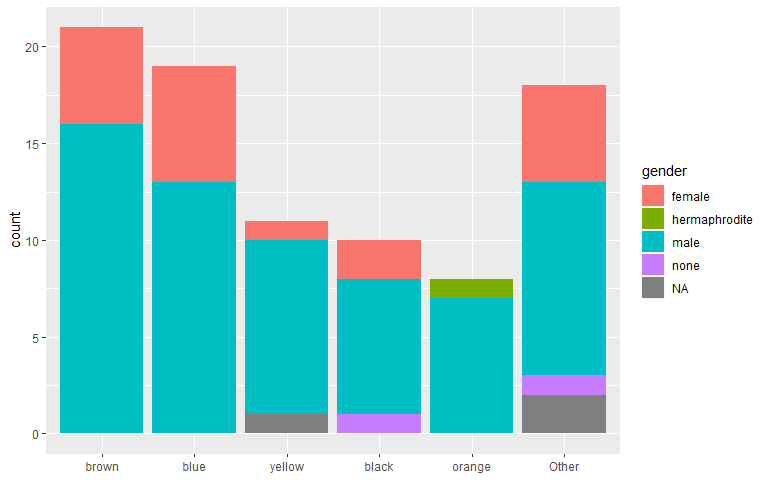

Introduction to R for Librarians
================
John Little
2019-07-11

<!-- README.md is autogenerated from README.Rmd.  Please only edit README.Rmd -->

| Sections    | Time       |
| ----------- | ---------- |
| Welcome     | 5 minutes  |
| Questions   | 15 minutes |
| Get Started | 5 minutes  |

## Welcome

  - Bathrooms
  - Code of Conduct
  - Greet your neighbors
  - Meet your instructors and roamers

## Questions

  - What is R? (data first)

  - Why R Studio? (IDE)

  - Why data science?

  - Are we going to do *machine learning* … – Can I take the blue pill
    now?

  - What is the Tidyverse? (consistent, modern, data science)
    
      - What is tidy data

### Questions we’ll answer along the way

  - What about **Excel**
  - Importance of **Reproducibility**
  - What is **Version Control**
  - What is **Literate Coding**
  - I work in a library, why are you talking to me about **coding**
  - What is **Collaborative Coding**
  - **Who is your** most likely **collaborator**
  - How many **versions** of your **reports do you** want to **make**

## Let’s get started

``` r
ggplot(data = ____, aes(x = ___, y = ___)) +
  geom____()
```

<!-- --><!-- -->
